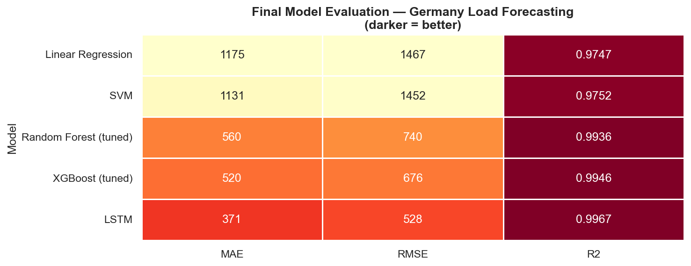
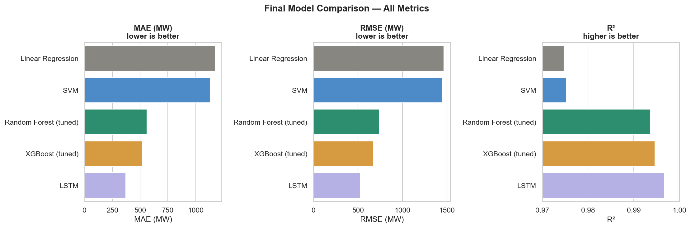
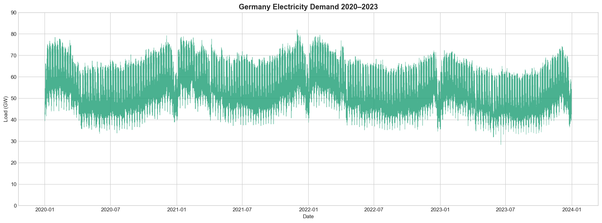
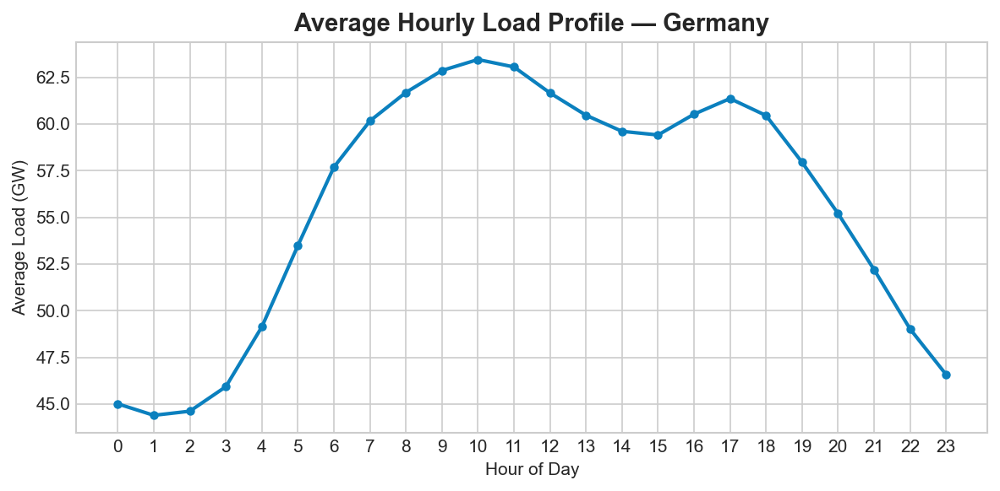
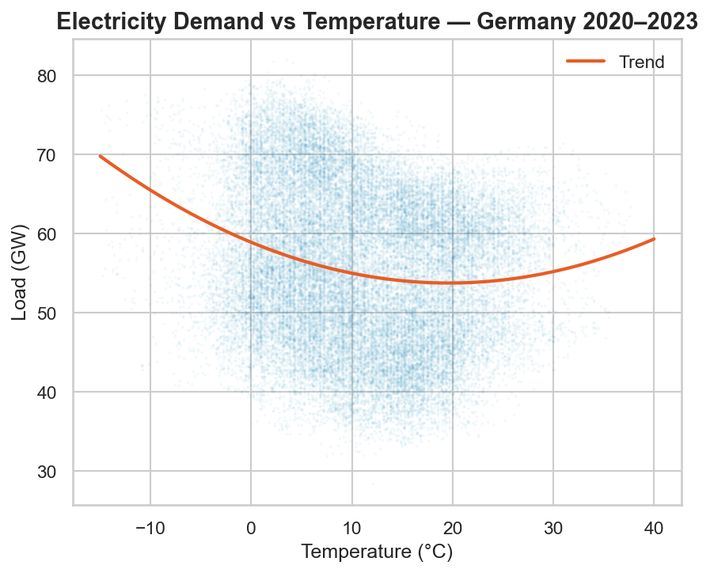
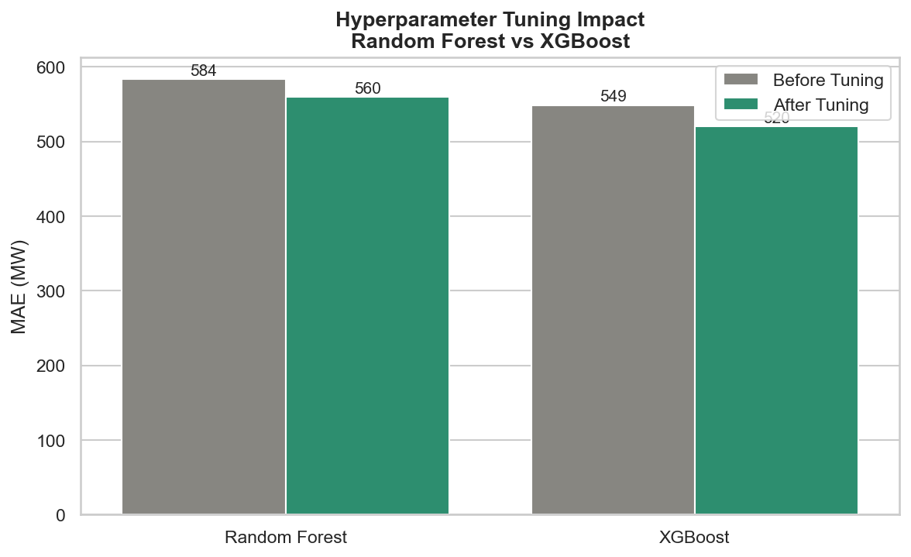
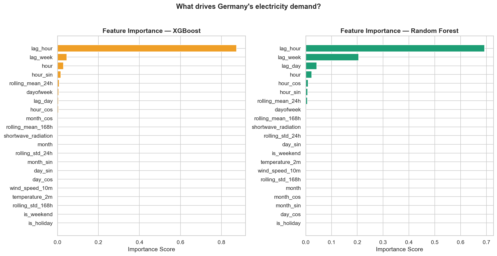
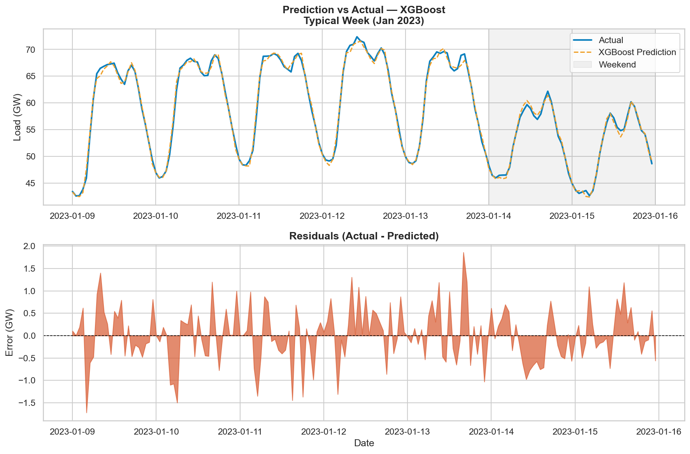

# ⚡ Germany Electricity Load Forecasting


> Hourly electricity demand forecasting for Germany using machine learning and deep learning — trained on 4 years of ENTSO-E load data combined with weather features.



---

## Overview

This project builds an end-to-end machine learning pipeline to forecast Germany's hourly electricity load. Five models are trained, tuned, and compared — from a simple Linear Regression baseline up to an LSTM deep learning model.

**Best result: LSTM — MAE 371 MW, RMSE 528 MW, R² 0.9967**

---

## Results

| Model | MAE (MW) | RMSE (MW) | R² |
|---|---|---|---|
| Linear Regression | 1175 | 1467 | 0.9747 |
| SVM | 1131 | 1452 | 0.9752 |
| Random Forest (tuned) | 560 | 740 | 0.9936 |
| XGBoost (tuned) | 520 | 676 | 0.9946 |
| **LSTM** | **371** | **528** | **0.9967** |



---

## Pipeline

```
Raw Data (ENTSO-E + Weather)
        ↓
  Data Cleaning
        ↓
  EDA & Visualization
        ↓
  Feature Engineering
  (Lags + Fourier + Time)
        ↓
  Model Training
  (LR → SVM → RF → XGB → LSTM)
        ↓
  Hyperparameter Tuning
        ↓
  Final Evaluation
```

---

## Project Structure

```
ML_Load_Forecasting/
│
├── data/
│   ├── Bronze/             # Raw data (ENTSO-E load + weather)
│   │   ├── Entsoe_2020_2023.csv
│   │   └── weather_2020_2023.csv
│   ├── Silver/             # Cleaned data
│   │   └── df_clean.csv
│   └── Gold/               # Feature-engineered data
│       ├── df_features.csv
│       └── df_features_fourier_time_encoding.csv
│
├── notebooks/
│   ├── 01_data_collection.ipynb
│   ├── 02_data_cleaning.ipynb
│   ├── 03_EDA.ipynb
│   ├── 04_feature_engineering.ipynb
│   ├── 04_feature_engineering_time_encoding.ipynb
│   ├── 05_model_training.ipynb
│   ├── 05_model_training_fourier_features.ipynb
│   ├── 06_hypertuning.ipynb
│   ├── 07_LSTM_Model.ipynb
│   ├── 08_feature_importance.ipynb
│   └── 09_final_evaluation.ipynb
│
├── models/                 # Saved trained models (.pkl)
├── figures/                # All plots and visualizations
├── requirements.txt
└── README.md
```

---

## Notebooks

| # | Notebook | Description |
|---|---|---|
| 01 | `01_data_collection.ipynb` | Load ENTSO-E electricity data and ERA5 weather data |
| 02 | `02_data_cleaning.ipynb` | Handle missing values, align timestamps, remove outliers |
| 03 | `03_EDA.ipynb` | Exploratory analysis — seasonal patterns, temperature correlation |
| 04 | `04_feature_engineering.ipynb` | Lag features, rolling statistics, time & holiday features |
| 04 | `04_feature_engineering_time_encoding.ipynb` | Fourier-based cyclical time encoding |
| 05 | `05_model_training.ipynb` | Train Linear Regression, SVM, Random Forest, XGBoost |
| 05 | `05_model_training_fourier_features.ipynb` | Model training with Fourier-encoded features |
| 06 | `06_hypertuning.ipynb` | RandomizedSearchCV with TimeSeriesSplit for RF and XGB |
| 07 | `07_LSTM_Model.ipynb` | LSTM with 24h rolling window, StandardScaler, Early Stopping |
| 08 | `08_feature_importance.ipynb` | RF and XGB feature importances |
| 09 | `09_final_evaluation.ipynb` | Final comparison of all 5 models |

---

## Features

### Lag Features
| Feature | Description |
|---|---|
| `load_t1h` | Load 1 hour ago |
| `load_t24h` | Load 24 hours ago (same hour yesterday) |
| `load_t168h` | Load 168 hours ago (same hour last week) |
| `rolling_mean_24h` | 24h rolling average |
| `rolling_mean_168h` | 168h rolling average |
| `rolling_std_24h` | 24h rolling standard deviation |

### Time Features
| Feature | Description |
|---|---|
| `hour` | Hour of day (0–23) |
| `weekday` | Day of week (0–6) |
| `month` | Month (1–12) |
| `is_weekend` | Saturday / Sunday flag |
| `is_holiday` | German public holiday flag |

### Weather Features
| Feature | Description |
|---|---|
| `temperature` | Air temperature (°C) |
| `wind_speed` | Wind speed (m/s) |
| `radiation` | Solar radiation (W/m²) |

### Fourier / Cyclical Encoding
Time features encoded as sine/cosine pairs to preserve cyclical structure:

$$\text{sin\_hour} = \sin\left(\frac{2\pi \cdot \text{hour}}{24}\right), \quad \text{cos\_hour} = \cos\left(\frac{2\pi \cdot \text{hour}}{24}\right)$$

---

## Data

- **Source:** [ENTSO-E Transparency Platform](https://transparency.entsoe.eu/) (electricity load) + ERA5 / Open-Meteo (weather)
- **Period:** 2020-01-01 → 2023-12-31 (~35,000 hourly observations)
- **Train/Test Split:** 2020–2022 train | 2023 test (temporal split, no leakage)
- **Country:** Germany (DE)

---

## EDA Highlights







Key findings from EDA:
- Clear **winter peak** demand (heating) and **summer dip**
- Strong **morning ramp** (~06:00) and **evening peak** (~18:00–20:00) every weekday
- **Weekends and holidays** average 15–20% lower load than weekdays
- **Temperature** is the strongest single weather predictor (negative correlation in summer, positive in winter — U-shaped)

---

## Model Details

### Random Forest & XGBoost — Tuning
Hyperparameter tuning via `RandomizedSearchCV` with `TimeSeriesSplit(n_splits=5)` to prevent data leakage across time.

```python
TimeSeriesSplit(n_splits=5)   # respects temporal order
n_iter = 20                   # 20 random combinations
scoring = "neg_mean_absolute_error"
```

**Best XGBoost params:**
```
n_estimators   = 300
max_depth      = 5
learning_rate  = 0.1
subsample      = 0.6
colsample_bytree = 1.0
```



### LSTM
- **Window size:** 24 hours (each prediction sees the last 24 hours as a sequence)
- **Architecture:** 2 × LSTM layers (128 units → 64 units) + Dense(1)
- **Normalization:** StandardScaler on both X and y (required for stable LSTM training)
- **Training:** Adam optimizer, Early Stopping (patience=10), batch_size=64
- Input shape: `(samples, 24 timesteps, 21 features)`

---

## Feature Importance



Top features across RF and XGB:
1. `load_t1h` — last hour's load (strongest predictor)
2. `load_t24h` — same hour yesterday
3. `load_t168h` — same hour last week
4. `rolling_mean_24h` — 24h trend
5. `temperature` — weather driver

---

## Prediction vs Actual



---

## Setup

### Requirements

```bash
pip install -r requirements.txt
```

Key dependencies:
- `pandas`, `numpy` — data processing
- `scikit-learn` — ML models and preprocessing
- `xgboost` — gradient boosting
- `tensorflow` / `keras` — LSTM model
- `matplotlib`, `seaborn` — visualizations
- `joblib` — model serialization
- `holidays` — German public holiday calendar

### Run the Pipeline

Execute notebooks in order:

```bash
# 1. Data collection
jupyter notebook notebooks/01_data_collection.ipynb

# 2–9. Follow numbered sequence...
jupyter notebook notebooks/09_final_evaluation.ipynb
```

---

## Key Takeaways

- **Lag features dominate** — yesterday and last-week load are the strongest predictors. The model essentially learns "today looks like yesterday at the same hour"
- **Fourier encoding improves over raw integers** for cyclical time features (hour, weekday, month)
- **LSTM captures temporal dependencies** that tree-based models miss, leading to a ~30% MAE reduction over XGBoost
- **Temperature matters** but is secondary to lag features for short-horizon forecasting
- **Holidays must be modeled explicitly** — without holiday flags, models systematically over-predict demand on public holidays

---

## License

This project is for educational and portfolio purposes. Data sourced from publicly available ENTSO-E and ERA5 datasets.
