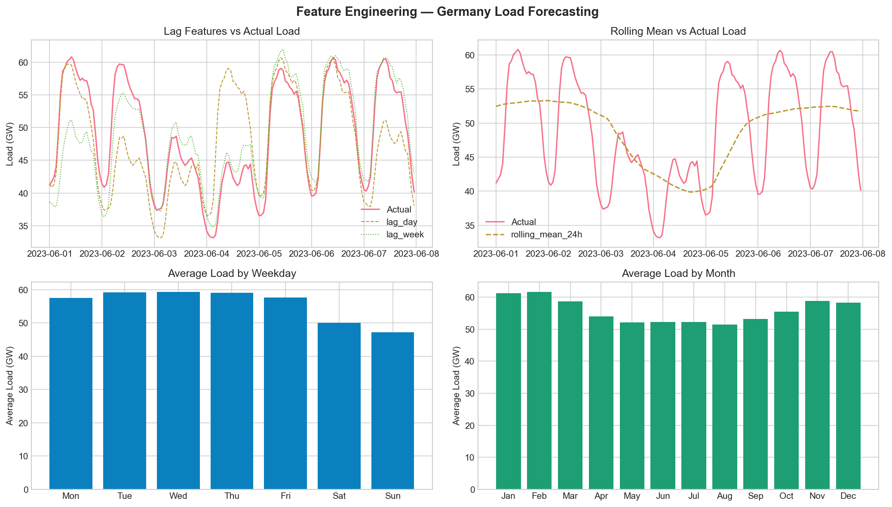
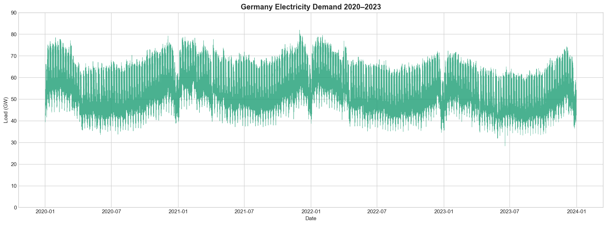
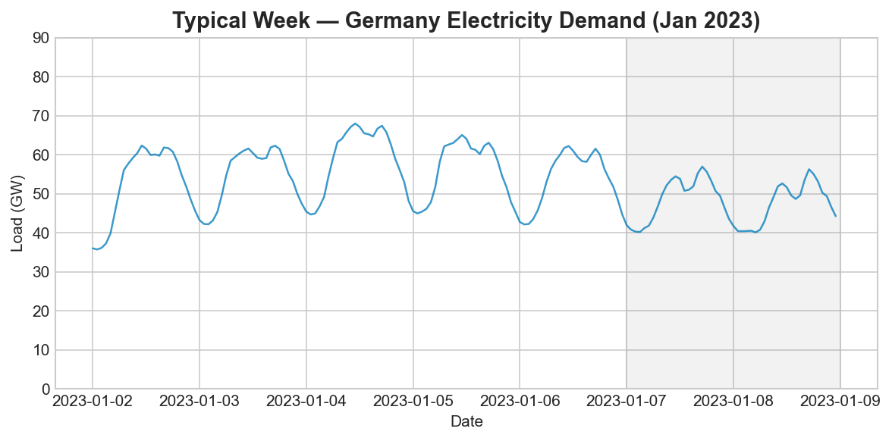
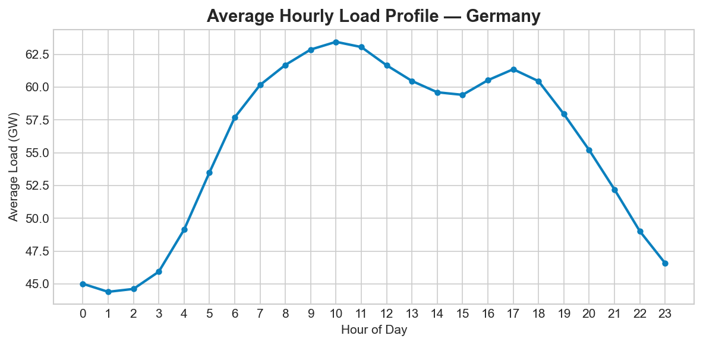
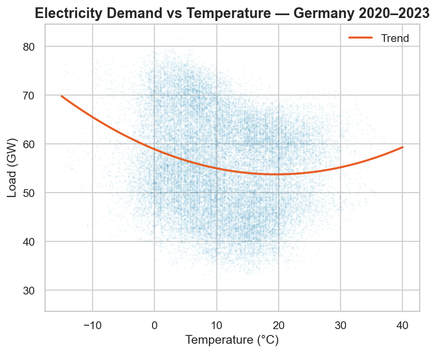

# ⚡ Germany Electricity Load Forecasting


> Hourly electricity demand forecasting for Germany using machine learning and deep learning — trained on 4 years of ENTSO-E load data combined with weather features. Three forecasting scenarios: one-step (1h-ahead), day-ahead with lag features, and day-ahead without lag features. The project also includes a **risk-aware quantile forecasting** layer that adds a probabilistic safety margin on top of the point forecast.

.png>)

---

## Overview

This project builds an end-to-end machine learning pipeline to forecast Germany's hourly electricity load. Five models are trained, tuned, and compared — from a simple Linear Regression baseline up to an LSTM deep learning model. Three distinct forecasting scenarios are evaluated to measure the real-world value of lag features and different prediction horizons.

**Best result: XGBoost — MAE 583 MW, RMSE 767 MW, R² 0.9931 (one-step scenario)**

---

## Results (All Scenarios)

After identifying and fixing **Data Leakage** in the initial rolling features, all models were evaluated across three scenarios. Results are compared against **Naive Persistence Benchmarks** to measure genuine forecasting skill.

### Scenario 1 — One-Step (1h-ahead)

| Model | MAE (MW) | RMSE (MW) | R² |
|---|---|---|---|
| **XGBoost** | **583** | **767** | **0.9931** |
| SVM | 1,110 | — | — |
| Linear Regression | 1,140 | — | — |
| LSTM | 1,167 | 1,488 | 0.9738 |
| *Persistence (1h)* | *1,786* | — | — |
| *Persistence (Week)* | *2,382* | — | — |

### Scenario 2 — Day-Ahead with Lag Features

| Model | MAE (MW) | RMSE (MW) | R² |
|---|---|---|---|
| **XGBoost** | **1,402** | **1,845** | **0.9599** |
| SVM | 1,834 | — | — |
| Linear Regression | 1,872 | — | — |
| LSTM | 2,235 | — | — |
| *Persistence (Day)* | *3,965* | — | — |
| *Persistence (Week)* | *2,382* | — | — |

### Scenario 3 — Day-Ahead without Lag Features (Ablation)

| Model | MAE (MW) |
|---|---|
| **XGBoost** | **3,802** |
| LSTM | 3,850 |
| *Persistence (Day)* | *3,965* |
| Linear Regression | 4,421 |
| SVM | 4,508 |
| *Persistence (Week)* | ***2,382*** |

> **Key finding:** Without lag features, **all ML models fail to beat the weekly persistence baseline (2,382 MW)**, demonstrating that lag features are the single most critical component of the feature set.

.png>)

---

## Data Integrity & Leakage Prevention

A critical phase of this project was the identification and correction of **Look-ahead Bias**.
- **The Issue:** Initial rolling features included the target hour's value, leading to an artificial MAE of 371 MW.
- **The Fix:** Implemented a strict `df.shift(1)` before calculating all rolling statistics and lag features.
- **Validation:** Every feature at time $t$ now only uses information available at $t-1$.

```python
# Correct way to create features without leakage
df["lag_hour"] = df["Load_MW"].shift(1)
df["rolling_mean_24h"] = df["Load_MW"].shift(1).rolling(window=24).mean()
```

---

## Pipeline

```
Raw Data (ENTSO-E + Weather)
        ↓
  Data Cleaning
        ↓
  EDA & Visualization
        ↓
  Feature Engineering
  (Lags + Fourier + Time)
        ↓
  Model Training
  (LR → SVM → RF → XGB → LSTM)
        ↓
  Hyperparameter Tuning
        ↓
  Final Evaluation (09)
        ↓
  Day-Ahead Scenarios
  (10: with lags | 11: without lags)
        ↓
  Cross-Scenario Result Plots
```

---

## Project Structure

```
ML_Load_Forecasting/
│
├── data/
│   ├── Bronze/             # Raw data (ENTSO-E load + weather)
│   │   ├── Entsoe_2020_2023.csv
│   │   └── weather_2020_2023.csv
│   ├── Silver/             # Cleaned data
│   │   └── df_clean.csv
│   └── Gold/               # Feature-engineered data
│       └── df_features_fourier_time_encoding.csv
│
├── notebooks/
│   ├── 01_data_collection.ipynb
│   ├── 02_data_cleaning.ipynb
│   ├── 03_EDA.ipynb
│   ├── 04_feature_engineering_time_encoding.ipynb
│   ├── 05_model_training_fourier_features.ipynb
│   ├── 06_hypertuning.ipynb
│   ├── 07_LSTM_Model.ipynb
│   ├── 08_feature_importance.ipynb
│   ├── 09_final_evaluation.ipynb
│   ├── 10-day-ahead-model-lag_features.ipynb         ← NEW
│   ├── 11-day-ahead-model-without_lag_features.ipynb ← NEW
│   └── result_plots.ipynb                            ← NEW
│
├── models/                 # Saved trained models (.pkl)
├── figures/                # All plots and visualizations
├── requirements.txt
└── README.md
```

---

## Notebooks

| # | Notebook | Description |
|---|---|---|
| 01 | `01_data_collection.ipynb` | Load ENTSO-E electricity data and ERA5 weather data |
| 02 | `02_data_cleaning.ipynb` | Handle missing values, align timestamps, remove outliers |
| 03 | `03_EDA.ipynb` | Exploratory analysis — seasonal patterns, temperature correlation |
| 04 | `04_feature_engineering_time_encoding.ipynb` | Lag features, rolling stats, time & Fourier cyclical encoding |
| 05 | `05_model_training_fourier_features.ipynb` | Train LR, SVM, RF, XGBoost with Fourier-encoded features |
| 06 | `06_hypertuning.ipynb` | RandomizedSearchCV with TimeSeriesSplit for RF and XGB |
| 07 | `07_LSTM_Model.ipynb` | LSTM with 24h rolling window, StandardScaler, Early Stopping |
| 08 | `08_feature_importance.ipynb` | RF and XGB feature importances |
| 09 | `09_final_evaluation.ipynb` | Final one-step comparison of all 5 models |
| 10 | `10-day-ahead-model-lag_features.ipynb` | Day-ahead (24h horizon) with lag features — LR, SVM, XGB, LSTM + **quantile/risk-aware buffer** |
| 11 | `11-day-ahead-model-without_lag_features.ipynb` | Day-ahead ablation: same models without any lag features |
| — | `result_plots.ipynb` | Cross-scenario bar charts comparing all models and persistence baselines |

---

## Features

### Lag Features (Scenarios 1 & 2)
| Feature | Description |
|---|---|
| `load_t1h` / `lag_day` | Load 1h or 24h ago |
| `load_t24h` / `lag_week` | Load 24h or 168h ago (same hour yesterday / last week) |
| `load_t168h` / `lag_2week` | Load 168h or 336h ago |
| `rolling_mean_24h` | 24h rolling average (shifted to prevent leakage) |
| `rolling_mean_168h` / `rolling_mean_week` | 7-day rolling average (shifted by 24h for day-ahead) |
| `rolling_std_24h` | 24h rolling standard deviation |

### Time Features
| Feature | Description |
|---|---|
| `hour` | Hour of day (0–23) |
| `weekday` | Day of week (0–6) |
| `month` | Month (1–12) |
| `is_weekend` | Saturday / Sunday flag |
| `is_holiday` | German public holiday flag |
| `is_rest_day` | Holiday or weekend combined flag |

### Weather Features
| Feature | Description |
|---|---|
| `temperature_2m` | Air temperature at 2 m (°C) |
| `wind_speed_10m` | Wind speed at 10 m (m/s) |
| `shortwave_radiation` | Solar radiation (W/m²) |

### Fourier / Cyclical Encoding
Time features encoded as sine/cosine pairs to preserve cyclical structure (used in all scenarios):

$$\text{sin\_hour} = \sin\left(\frac{2\pi \cdot \text{hour}}{24}\right), \quad \text{cos\_hour} = \cos\left(\frac{2\pi \cdot \text{hour}}{24}\right)$$

Applied to hour (period 24), day-of-week (period 7), and month (period 12).




---

## Data

- **Source:** [ENTSO-E Transparency Platform](https://transparency.entsoe.eu/) (electricity load) + ERA5 / Open-Meteo (weather)
- **Period:** 2020-01-01 → 2023-12-31 (~35,000 hourly observations)
- **Train/Test Split:** 2020–2022 train | 2023 test (temporal split, no leakage)
- **Country:** Germany (DE)

---

## EDA Highlights









Key findings from EDA:
- Clear **winter peak** demand (heating) and **summer dip**
- Strong **morning ramp** (~06:00) and **evening peak** (~18:00–20:00) every weekday
- **Weekends and holidays** average 15–20% lower load than weekdays
- **Temperature** is the strongest single weather predictor (negative correlation in summer, positive in winter — U-shaped)

---

## Model Details

### Random Forest & XGBoost — Tuning
Hyperparameter tuning via `RandomizedSearchCV` with `TimeSeriesSplit(n_splits=5)` to prevent data leakage across time.

```python
TimeSeriesSplit(n_splits=5)   # respects temporal order
n_iter = 20                   # 20 random combinations
scoring = "neg_mean_absolute_error"
```

**Best XGBoost params:**
```
n_estimators   = 300
max_depth      = 5
learning_rate  = 0.1
subsample      = 0.6
colsample_bytree = 1.0
```


### Quantile Regression

`GradientBoostingRegressor(loss="quantile")` from scikit-learn is used to model the **90th percentile** of the load distribution. Unlike the mean forecast, the q90 model is calibrated to be exceeded only 10% of the time, giving a principled upper bound for grid capacity planning.

| Metric | Description |
|---|---|
| **Pinball Loss** | Standard scoring rule for quantile forecasts: $L_\alpha(y, \hat{q}) = \alpha \max(y-\hat{q},0) + (1-\alpha)\max(\hat{q}-y,0)$ |
| **Cost-Aware MAE** | Asymmetric metric weighting under-predictions ×2 relative to over-predictions |

---

### LSTM

**One-step LSTM (notebook 07)**
- **Window size:** 24 hours (predicts 1h ahead after a 24h context window)
- **Architecture:** 2 × LSTM layers (128 units → 64 units) + Dense(1)
- **Normalization:** StandardScaler on both X and y (required for stable LSTM training)
- **Training:** Adam optimizer, Early Stopping (patience=10), batch_size=64
- Input shape: `(samples, 24 timesteps, 21 features)`

**Day-ahead LSTM (notebooks 10 & 11)**
- **Architecture:** LSTM(64, return_sequences=True) → Dropout(0.2) → LSTM(32) → Dropout(0.2) → Dense(16, ReLU) → Dense(1)
- **Sequence construction (with lags):** window=24, horizon=24 → predicts `y[i + 24 + 24 - 1]` (true 24h-ahead)
- **Sequence construction (no lags):** window=24 → predicts `y[i + 24]` (next step after 24h context)
- **Training:** Adam, MSE loss, Early Stopping (patience=5, restore_best_weights), batch_size=32, max 50 epochs
- Input shape: `(samples, 24 timesteps, 16 features)` with lags | `(samples, 24 timesteps, 12 features)` without

---

## Feature Importance

Top features across RF and XGB:
1. `load_t1h` — last hour's load (strongest predictor)
2. `load_t24h` — same hour yesterday
3. `load_t168h` — same hour last week
4. `rolling_mean_24h` — 24h trend
5. `temperature` — weather driver

---

## Prediction vs Actual

.png>)

---

## Risk-Aware Forecasting (Quantile Regression)

In addition to the point forecast, notebook 10 implements a **probabilistic safety margin** for grid operations using quantile regression.

### Why it matters
For grid operators, under-predicting demand is costlier than over-predicting — a forecast that is too low can cause supply shortfalls, while a forecast that is too high results in manageable over-provisioning. A mean forecast alone is insufficient for risk management.

### Approach
- A second model, `GradientBoostingRegressor(loss="quantile", alpha=0.9)`, is trained to predict the **90th percentile** of demand.
- The gap between the mean XGBoost forecast and the q90 quantile forms the **safety buffer**.
- Performance is measured with **Pinball Loss** (the standard metric for quantile forecasts).

```python
from sklearn.ensemble import GradientBoostingRegressor
from sklearn.metrics import mean_pinball_loss

# Train a q90 quantile model
model_q90 = GradientBoostingRegressor(loss="quantile", alpha=0.9)
model_q90.fit(X_train, y_train_raw.values.ravel())
pred_q90 = model_q90.predict(X_test)

# Evaluate
pinball = mean_pinball_loss(y_test_raw.values.ravel(), pred_q90, alpha=0.9)
print(f"Pinball Loss (q=0.9): {pinball:.2f}")
```

### Asymmetric Cost Metric
A custom **cost-aware metric** penalises under-predictions twice as heavily as over-predictions, reflecting the operational asymmetry:

```python
error = y_test_raw.values.ravel() - y_xgb_predict
cost = np.where(error > 0, error * 2, np.abs(error))  # under-prediction × 2
print(f"Cost-aware metric: {cost.mean():.2f}")
```

### Under- vs Over-Prediction Rate
Analysis of the XGBoost day-ahead forecast directional bias (what % of hours the model is under vs. over the actual demand).


> The shaded orange region shows the safety margin between the mean XGBoost forecast (green) and the 90th-percentile upper bound (dashed orange). Grid operators can use this band to ensure reserves are scheduled with a statistical guarantee that covers the majority of demand spikes.

---

## Setup

### Requirements

```bash
pip install -r requirements.txt
```

Key dependencies:
- `pandas`, `numpy` — data processing
- `scikit-learn` — ML models and preprocessing
- `xgboost` — gradient boosting
- `tensorflow` / `keras` — LSTM model
- `matplotlib`, `seaborn` — visualizations
- `joblib` — model serialization
- `holidays` — German public holiday calendar

### Run the Pipeline

Execute notebooks in order:

```bash
# 1. Data collection
jupyter notebook notebooks/01_data_collection.ipynb

# 2–9. Core pipeline (cleaning → EDA → features → training → tuning → evaluation)
jupyter notebook notebooks/09_final_evaluation.ipynb

# 10–11. Day-ahead forecasting scenarios
jupyter notebook notebooks/10-day-ahead-model-lag_features.ipynb
jupyter notebook notebooks/11-day-ahead-model-without_lag_features.ipynb

# Cross-scenario result plots
jupyter notebook notebooks/result_plots.ipynb
```

---

## Key Takeaways

- **Integrity > Accuracy:** Fixing data leakage increased the MAE but produced a valid, production-ready model. Initial rolling features yielded an artificially low MAE of 371 MW before the leakage was corrected with `shift(1)`.
- **XGBoost dominates all scenarios:** XGBoost is the best model in every forecasting scenario — one-step (583 MW), day-ahead with lags (1,402 MW), and day-ahead without lags (3,802 MW).
- **Beating the Baseline:** XGBoost outperforms the 1h-Persistence benchmark by **67%** (one-step) and the Day-ahead Weekly Persistence by **41%** (with lag features).
- **Lag features are the most critical component:** Removing them triples the MAE for tree-based models and causes all four ML models to underperform even the naive weekly persistence baseline.
- **LSTM does not outperform XGBoost here:** Despite its theoretical advantage for time series, LSTM consistently lags behind XGBoost across all three scenarios.
- **Fourier encoding improves over raw integers** for cyclical time features (hour, weekday, month).
- **Temperature matters** but is secondary to lag features for short-horizon forecasting.
- **Holidays must be modeled explicitly** — without holiday flags, models systematically over-predict demand on public holidays.
- **Day-ahead forecasting with lags is still practical:** XGBoost achieves MAE 1,402 MW (R² 0.9599) using only 24h-old actuals, well ahead of all naive baselines.
- **Risk-aware forecasting adds operational value:** A q90 quantile model built on top of the XGBoost point forecast provides a probabilistic upper bound for grid capacity planning, measured via Pinball Loss.
- **Under-prediction is systematically more costly:** The asymmetric cost analysis shows that grid operators should prefer a slight over-forecast bias — a finding directly encoded in the cost-aware metric and the q90 safety margin.

---

## License

This project is for educational and portfolio purposes. Data sourced from publicly available ENTSO-E and ERA5 datasets.
